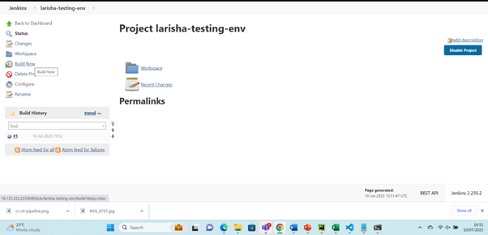

# CI/CD (Continuous Integration and Continuous Delivery/Deployment)

## What is CICD?

CI/CD is considered to be the backbone of DevOps practices and automations. It is a software development practise that involves automating the process of integrating code changes, running tests and deploying the application.

Continuous Delivery is an extension to continous intergration which helps in ensuring that the new releases can get to customers faster in a sustainable way. Additionally, Contionous Deployment is one more step to continuous delivery whhich helps to ensure that every changes made passes all the stages of the production pipleline to be released to the customers.

## Why Jenkins?

Jenkins is a open source automation server in which the central build and CI process can take place. It is a java-based program. Free with lots of dependecies making it easier to use. The plugins are powerful and easy to use. 

## Other tools that can be used for CICD

- Gitlab CI/CD
- Travis CI
- CircleCI
- Azure DevOps

## Why build a pipeline?
- Automation and Efficiency
- Faster Time to market
- Saves time (3 days work to be done in 3 minutes)

## Business value?
- Faster time to market.
- Improved Software Quality
- Scalability
- Efficieny and productivity
- Saves Cost (making it profitable)
  
# Architecture of Software Development Lifecycle

  Plan -> Design -> Develop -> Test -> Deploy

1. The code is initially stored on a local 

2. A pair of SSH keys is generated and one key is added to the GitHub account this helps in connecting with GitHub. 

3. A webhook is set up, which automates the process of pushing code to the next stage whenever changes are made locally.Using webhook takes away the need for manual commands.

4. An SSH key is generated on GitHub and linked to Jenkins.

5. The code is tested, specifically by adding a payment gateway to ensure it functions correctly.

6. A master node is used to conduct automated tests before moving the code into production.

7. An agent node is employed in the testing process working with master node.

8. If the tests pass successfully, the code is pushed to the production. However, if the tests fail, the code is sent back to the CI stage for further planning and designing and building.

9. The code is then deployed to an EC2 instance on AWS using SSH. Port 22 is used for SSH communication.

# How to build project on Jenkins;

1. Log in to Jenkins
2. Go to New Item.
3. Enter the item name (larish-testing-env)
4. Then select freestyle project and select ok
5. Select discard old builds and for max number of   build put 3 as shown in the image.

6. Then go to build option and select execute shell and on description write a linux command. For example I put uname which will give the name of operating system I am using. 

7. Then select save.
8. Then go to build now.

9. On build history select the arrow down and select console output.

