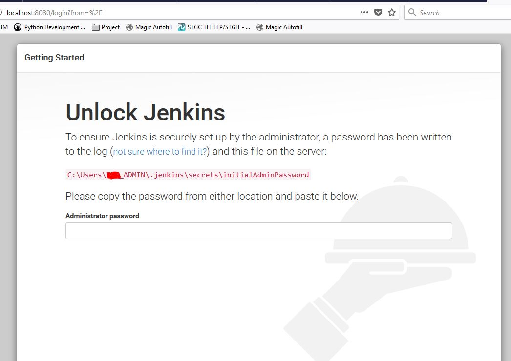

What is CICD?

Continous Integration and Continous Delivery. 

CI (Continuous Integration):
CI is like a team collaboration. Whenever someone on the team makes a code change, they immediately share it with everyone else. This ensures that everyone is working with the latest code and any issues are caught early. It involves automating the process of building and testing code changes.

CD (Continuous Delivery) and CDE (Continuous Deployment):
CD takes CI a step further by automatically preparing the code for release. It includes tasks like packaging the code, deploying it to the specific environments (e.g., staging, production), and running additional tests. CDE goes even further and automatically deploys the code to production without manual intervention.

Key difference: CD makes sure the code is ready for release, while CDE actually puts the code into production.# How to build jenkins server on AWS.

# What is Jenkins and why jenkins?

Jenkins is open source automates repetitive tasks in software development. It provides a user-friendly website where you can define and schedule jobs. These jobs can build, test, and deploy your code automatically. Jenkins integrates with tools like Git and has lots of plugins to customize its behavior.

# How to launch EC2 on AWS

1. Sign in to the AWS Management Console with your AWS account credentials.

2. Open the Amazon EC2 console by selecting "EC2".


3. From the EC2 dashboard, click on the "Launch Instance" button to start the instance creation process.

4. On the "Choose an Amazon Machine Image (AMI)" page, Select ubuntu 18.04 LTS 1e9.
  


5. Choose an instance type.
   

   
6. Configure the instance details, including the number of instances you want to launch, network settings, subnet, security group, etc. Select the security groups. For jenkins (SSH, HTTP, 3000, 8080)

7. Select Launch Instance.


# Install Jenkins

1. SSH into EC2 instance through terminal. 
2. Update the default Ubuntu packages lists for upgrades.
```
  ** sudo apt-get update**
```
1. Install JDK 11 (Java Development Kit)
```
   **sudo apt-get install openjdk-11-jdk**
```
1. Install Jenkins by adding the Jenkins repository and initiating the installation
  ```
  curl -fsSL https://pkg.jenkins.io/debian-stable/jenkins.io.key | sudo tee \
  /usr/share/keyrings/jenkins-keyring.asc > /dev/null
  
  echo deb [signed-by=/usr/share/keyrings/jenkins-keyring.asc] \
  https://pkg.jenkins.io/debian-stable binary/ | sudo tee \
  /etc/apt/sources.list.d/jenkins.list > /dev/null
  
  sudo apt-get update
  sudo apt-get install jenkins
  ```
5. Start the Jenkins service.
 ```
   **sudo systemctl start jenkins.service**
 ```
6. Check the status of the Jenkins service.

```
**sudo systemctl status jenkins**
```
7. Configure the firewall to allow access to Jenkins on port 8080.

```
**sudo ufw allow 8080**
**sudo ufw enable**
```
8. Verify the firewall status.
```
**sudo ufw status**
```
9.  Access the Jenkins setup wizard by entering the IP address of your EC2 instance along with port 8080 in a web browser.
```
**Copy Public Ip from EC2 instance and paste it on the web browser with IP:8080**
```

10. Retrieve the initial administrative password using the following command.
```
sudo cat /var/lib/jenkins/secrets/initialAdminPassword
```



# Getting started with jenkins:

1. Once you unlock jenkins it will ask you to create user name, full name, password, email address to register


2. Go to Dashboard and go to manage jenkins.


3. Go to available plugin and search for office 365, SSH agent, nodejs and install them.


4. Then on manage jenkins go to Security and all the way at the bottom for Gir host verification key choose accept firt connection. 
   


# How to build a project on jenkins;

1. Plan the artitechture 
2. Divide the jobs to different parts to break it down.

# Job 1: Test on dev 

1. Go to new item and create name larisha-CI and select freestyle project and select ok.

2. On general write description and select discard old builds and for max number of build enter 3. 


3. Select githup project and paste the URL of your github app repo.


4. On source code management select git and past the SSH url of your repo and select your private key. 


5. On branches to build write */dev 


6. On Build trigger and build environment select git hook trigger and nodejs respectively. 


7. Then go to build steps and select execute shell and type the linux command as shown in the picture and select save and build now. 


  

# Job 2: This part is to merge dev to main branch

1. Step 1-4 same as job 1.

2. Add additional behaviours and select merge before build. 


5. On branches to build write */dev 


6. On Build trigger and build environment select git hook trigger and nodejs respectively. 


7. Add post-build in and select git-publisher and select these two options and save and select build now. 

.


(First create a dev branch on github and make a change on dev branch and push the commit.

If the test pass then code should merge from dev to main branch.)

# Job 3: Copy the app to push to the production.

Steps are very similar to job 1 and job 2. 

- Instead of */dev branch on branches replace with */main. 

- Instead of selecting node option of build environment select ssh agent and select the .pem file. 

- And on build steps select execute shells and insert these commands. 
```
# Copy app folder
rsync -avz -e "ssh -o StrictHostKeyChecking=no" app ubuntu@3.249.240.27:/home/ubuntu

# SSH
ssh -o "StrictHostKeyChecking=no" ubuntu@ec2-3-249-240-27.eu-west-1.compute.amazonaws.com <<EOF
    # For app running without the db
    unset DB_HOST

    cd app
    npm install
    pm2 kill
    pm2 start app.js
EOF
```


